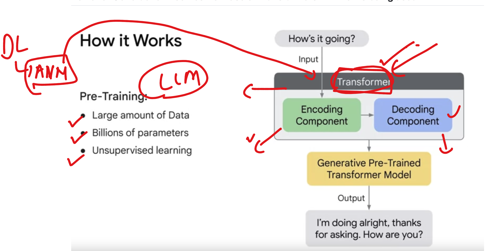

#  LLM are specific type of  ANN baesd model 

### Very Special ANN Category: Transformers

### Transformer Architecture Types

### LLM: Key Information

- LLMs use a layered architecture.
- The NLP layer is responsible for understanding human context and language.
- NLP relies on tokenization (character-level, word-level) to process language.

### Tokenization to Subword Tokenization

#### 🧩 Subword Tokenization in LLMs

**Why Subword Tokenization?**

Traditional tokenization methods face challenges:

- **Word-level tokenizers:** Large vocabularies (millions), leading to sparsity and out-of-vocabulary (OOV) issues.
- **Character-level tokenizers:** Small vocabularies, but result in longer sequences and less semantic information.

Subword tokenization breaks words into units smaller than words but larger than characters, providing a balance.

**Benefits:**

- Handles rare and unseen words by decomposing them (e.g., `antidisestablishmentarianism` → subwords).
- Compact vocabulary (~30K–50K tokens).
- Balances sequence length and semantic granularity.
- Offers cross-lingual flexibility (useful for multilingual models).

#### Popular Subword Tokenization Algorithms

- **Byte-Pair Encoding (BPE):**
    - Greedy, frequency-based merge algorithm.
    - Starts with characters, merges the most frequent symbol pairs.
    - Used in: GPT-2, GPT-3, RoBERTa, OpenLLaMA.

- **WordPiece:**
    - Probabilistic, used in BERT.
    - Optimizes the likelihood of the training corpus under a language model.

- **SentencePiece:**
    - Google's open-source library.
    - Works directly on raw text (no pre-tokenization needed).
    - Supports:
        - Unigram Language Model (used in T5, ALBERT)
        - BPE variant

- **Byte-level BPE:**
    - Operates at the UTF-8 byte level instead of characters.
    - Used in GPT-2/GPT-3 for better handling of emojis, symbols, and multilingual content.

## LLM labs on cloud and hosted ENV 

