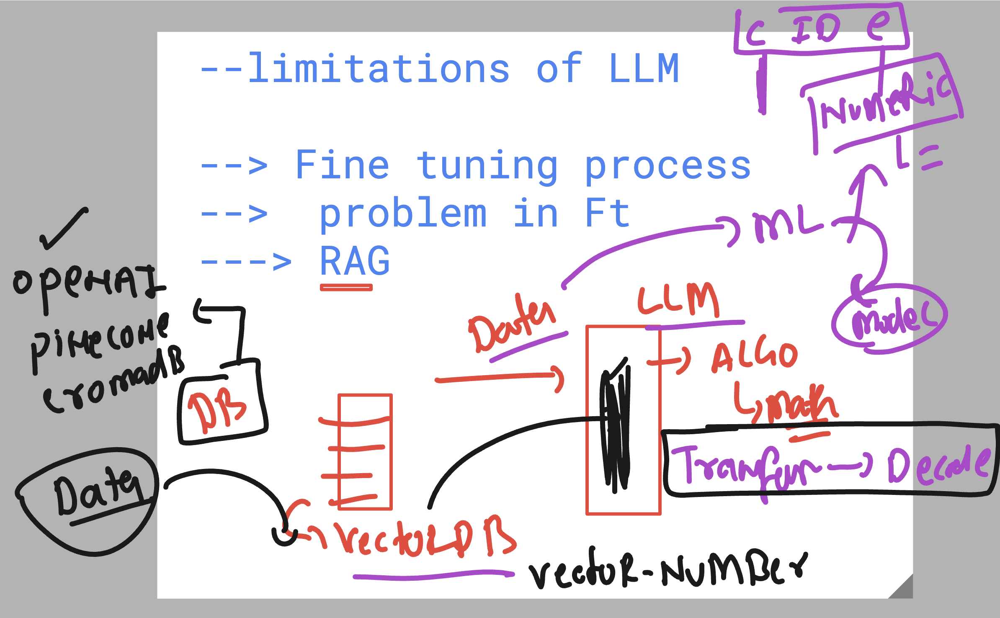

# walmart_LLMDeepDive_24thjUne2025

### few basic info to remember about LLM 


### RAG revision 



### LLM loading python modules explation 


### Understanding Model deployment context 


### taking python flask webUI code 

```
buntu@ip-172-31-38-78:~$ mkdir ashu-openai-deployment 
ubuntu@ip-172-31-38-78:~$ cp -rf  /tmp/Flask_chatUI/*   ashu-openai-deployment/
ubuntu@ip-172-31-38-78:~$ 
ubuntu@ip-172-31-38-78:~$ 
ubuntu@ip-172-31-38-78:~$ cd  ashu-openai-deployment/
ubuntu@ip-172-31-38-78:~/ashu-openai-deployment$ ls
app.py  requirements.txt  static  templates
ubuntu@ip-172-31-38-78:~/ashu-openai-deployment$ 

```
